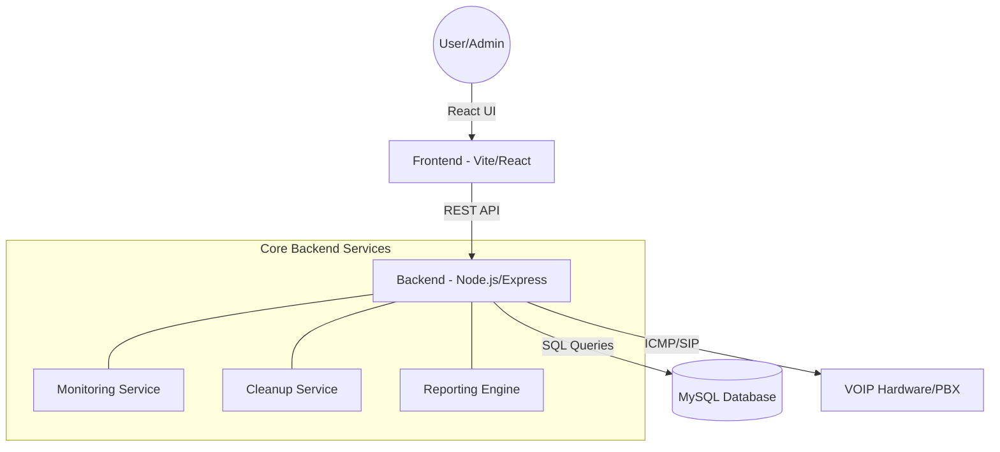

# VOIP Directory & Extension Monitoring System

## Project Technical Documentation

### 1. Executive Summary

The **VOIP Directory & Extension Monitoring System** is a robust, full-stack application designed to consolidate VOIP infrastructure management. It provides real-time status tracking for hardware, a searchable organizational directory, and automated administrative tools for data integrity and reporting.

---

### 2. System Architecture

The application follows a modern **Client-Server architecture** with a decoupled Frontend and Backend.

---

### 3. Technology Stack

| Layer | Technologies |
| :--- | :--- |
| **Frontend** | React (Vite), Bootstrap 5, Axios, React Router, jsPDF, XLSX |
| **Backend** | Node.js, Express, MySQL, Ping, Multer, PDFKit |
| **Network** | ICMP (Ping), TCP (SIP Port 5060), REST API |

---

### 4. Core Services & Logic

#### 📡 Real-time Monitoring Service

The heartbeat of the system. It periodically (default every 5 seconds) scans all registered VOIP hardware:

- **L3 Connectivity**: Uses ICMP Ping to verify if the hardware is reachable on the network.
- **L7 SIP Check**: Performs a TCP handshake on Port 5060 and integrates with the **Yeastar PBX API** to verify SIP registration status.
- **Result**: Updates the hardware status (Online/Offline) and logs the event for downtime reporting.

#### 🧹 Data Management & Cleanup

- **Directory Cleanup**: A background task that runs every 12 hours to automatically merge duplicate user records and sync extension data, ensuring the directory remains clean.
- **Bulk Import**: A robust engine that parses Excel and CSV files. It intelligently maps various column headers (e.g., "Full Name", "Ext #") to the database schema while skipping duplicates.

#### 📊 Reporting Engine

- **Downtime Analysis**: Generates daily or date-range reports focusing on failed pings (offline hardware).
- **Export Formats**: Provides professional PDF reports using `PDFKit` and Excel exports using `XLSX`.

---

### 5. Database Design & Logic

The system uses a relational MySQL database with three primary tiers of data:

1. **Core Directory**: `users` (Personal info, roles) and `extensions` (Hardware info, IP, Status).
2. **Metadata**: `departments`, `sections`, and `stations` for organizational grouping.
3. **Auditing**: `activity_logs` (admin actions) and `ping_logs` (hardware historical status).

---

### 6. Security & RBAC

The system implements **Role-Based Access Control (RBAC)**:

- **User Role**: Access to the searchable directory and basic functionality.
- **Admin Role**: Full CRUD access, bulk operations, system cleanup, and activity logs.
- **Authentication**: Secure login flow validating credentials against the database.

---

### 7. Key Features for Presentation

- **Searchable Directory**: Instant filtering by name, department, or extension.
- **Real-time Status Indicators**: Live color-coded status (Online/Offline) for all extensions.
- **Administrative Transparency**: Every change is logged in the Activity Log for audit trails.
- **Bulk Efficiency**: Handle hundreds of users via automated import and cleanup logic.
